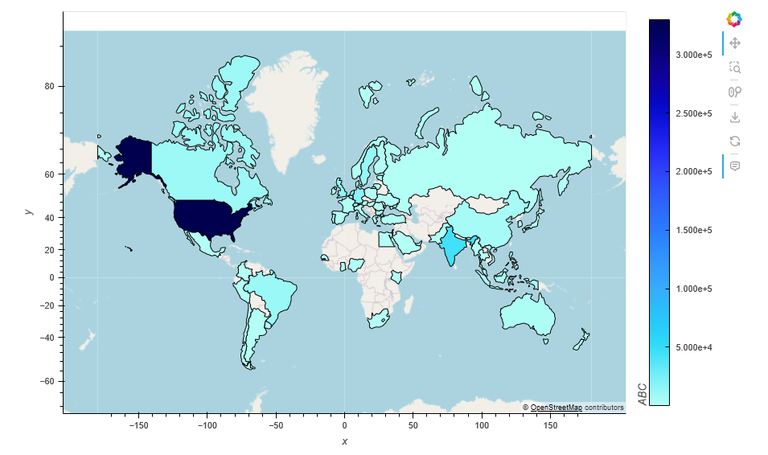

# Project 1 - Layoffs Data Analysis Post Covid-19
## Project Intro
In this project, I conducted an extensive analysis of global layoffs since the onset of the pandemic in 2020. Leveraging a comprehensive dataset, I explored various trends in layoffs both on a global scale and within specific industries. To bring this analysis to life, I harnessed the power of Python visualization libraries and the Geoapify API, enabling me to create compelling visual representations of the data.

## Instructions
This project is broken down into two deliverables Layoffs_Dataset_Cleanup and Layoffs_Dataset_Analysis.

### Prerequisties and Assumptions
-  This project is developed on Jupyter Notebook version 6.5.4
- Following Python libraries are required to run both part of the project
   - numpy 
   -  pandas 
   - requests
   -  json
   -  time
   - matplotlib.pyplot
   -  hvplot.pandas
   - geopandas  
- 

### Part 1: Dataset Cleanup
I got my project's data from [Kaggle](https://www.kaggle.com/), I downloaded the Layoffs Dataset from the website.
1. I then massaged the data to check and remove unwanted records and clean the data for further analysis.
2. Added two new columns for latitude and longitude to be used for Geoviews
2. Next, the [Geoapify API](https://www.geoapify.com/) and the [geoViews Python library](https://geoviews.org/) is used to retrieve respective cities latitude and longitude coordinates data for each city.
3. A clean sanitized dataset is then stored in the Output_Data folder to be used for further analysis in the next phase.

### Part 2: Dataset Analysis
This part of the projects focuses on using the sanitized dataset to analyze layoffs data since Covid-19. I have asked a set of questions to my sanitized data set and used various visualizations methods to efficently read the results.
1. What are the top 10 countries affected by layoffs?
   - Percentage of layoffs for top 10 countries.
   - Total number of layoffs in top 10 countries.
2. What are the top 10 industries affected by layoffs?
   - Percentage of top 10 industries affected by layoffs.
   - Total number of layoffs in top 10 industries.
3. What are the top 10 company stages that are affected by layoffs?
   - Total number of layoffs across different company stages.
4. What is the time series analysis of layoffs since Covid-19?
   - Worldwide layoffs count since Covid-19
   - USA vs ROW (Rest of the World) layoffs count since Covid-19
5. What is the relation between US vs ROW data?
   - Top 5 Cities
   - Top 5 Industries 
   - Top 5 Companies
6. What is the per year layoff statistics for USA since Covid-19?
   - By Industry
   - By Companies
7. What is the per year layoff statistics for Rest of the world (ROW) since Covid-19?
   - By Industry
   - By Companies
8. Boxplot and whisker plot for top 5 USA industries.
9. What is the impact of layoffs throughout the world?
   - World cities impacted
   - Countries impacted

## How to execute code?
1. Open api_keys.py under resources folder located at the same location as these jupyter notebooks.
2. Assign your Geoapify API key to "geoapify_key" variable.
3. Run `Layoffs_Dataset_Cleanup.ipynb` to read and clean the dataset before analysis 
**API keys will be required for Geoapify**.
5. `Layoffs_Dataset_Analysis.ipynb` should be run next as it is dependent on the data massaged in step 4. 
7. Graphs created by `Layoffs_Dataset_Analysis.ipynb` will be stored in `Output_Data\Images`.

## Future Enhancements
- I want to combine this dataset with the H-1B immigration status dataset to study the effects of layoffs on non immigrants in the USA

## References
- **Geoapify API** https://www.geoapify.com/
- **geoViews Python Library** https://geoviews.org/
- **Kaggle** https://www.kaggle.com/
- **Matplotlib Documentation** https://matplotlib.org/stable/index.html

